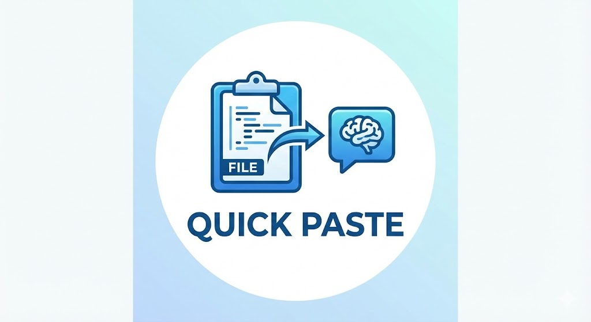

# Quick Paste

  

  <strong>Instantly copy file contents to clipboard with one click</strong>

  
  
  
  

---

## Overview

**Quick Paste** is a lightweight VS Code extension that adds a convenient copy button to your editor toolbar. With just one click, copy the entire contents of any open file to your clipboard - perfect for quickly sharing code, pasting into AI assistants, or moving content between projects.

## Features

- **One-Click Copy**: Click the copy icon in the editor toolbar to instantly copy file contents
- **Visual Feedback**: Get immediate confirmation with a toast notification
- **Always Accessible**: Button appears in the editor title bar whenever you have a file open
- **Lightweight**: Minimal performance impact, works seamlessly with your workflow
- **Universal**: Works with any file type - code, markdown, JSON, text, and more

## Demo

<video src="demo.mp4" controls></video>

_See Quick Paste in action - one click and your file is copied!_

## Installation

**Quick Paste is now live on the VS Code Marketplace!** 🎉

[📦 Install from VS Code Marketplace](https://marketplace.visualstudio.com/items?itemName=umershaikh123.quick-paste)

### From VS Code Marketplace

1. Open VS Code
2. Press `Ctrl+P` (or `Cmd+P` on Mac)
3. Type: `ext install umershaikh123.quick-paste`
4. Press Enter

Or click the "Install" button on the [Marketplace page](https://marketplace.visualstudio.com/items?itemName=umershaikh123.quick-paste)

### From GitHub

1. Download the `.vsix` file from the [releases page](https://github.com/umershaikh123/quick-paste/releases)
2. Open VS Code
3. Go to Extensions view (`Ctrl+Shift+X`)
4. Click the `...` menu → "Install from VSIX..."
5. Select the downloaded file

## Usage

1. Open any file in VS Code
2. **Important**: Make sure the file is **active** (double-click the file tab to activate it - single-clicking only previews the file)
3. Look for the copy icon (📋) in the top-right editor toolbar
4. Click the icon
5. Your file contents are now copied to clipboard!
6. A notification will confirm: "File copied!"

> **💡 Tip**: The copy button only appears when a file is **fully active**. In VS Code, single-clicking a file opens it in preview mode (italic tab title), while double-clicking makes it active (normal tab title). You need to double-click or make edits to activate the file and see the copy button.

### Keyboard Shortcut (Optional)

You can assign a custom keyboard shortcut:

1. Open Command Palette (`Ctrl+Shift+P`)
2. Type "Preferences: Open Keyboard Shortcuts"
3. Search for "Copy File Content"
4. Assign your preferred shortcut

## Use Cases

- **Share Code Quickly**: Copy entire files to paste in chat, email, or documentation
- **AI Assistant Integration**: Easily paste full file contents into ChatGPT, Claude, or GitHub Copilot
- **Code Review**: Grab complete file contents for review tools or discussions
- **Backup Snippets**: Quickly save file contents before making experimental changes
- **Multi-File Editing**: Copy content from one file to paste into another project
- **Documentation**: Include full code examples in your docs or tutorials

## Requirements

- Visual Studio Code version 1.106.1 or higher

## Extension Settings

This extension works out of the box with no configuration needed!

## Known Issues

No known issues at this time. If you encounter any problems, please [report them on GitHub](https://github.com/umershaikh123/quick-paste/issues).

## Release Notes

### 0.0.1 (Initial Release)

- Copy entire file contents with one click
- Editor toolbar button with copy icon
- Toast notification for user feedback
- Support for all file types

## Contributing

Contributions are welcome! Please feel free to submit a Pull Request.

1. Fork the repository
2. Create your feature branch (`git checkout -b feature/amazing-feature`)
3. Commit your changes (`git commit -m 'Add some amazing feature'`)
4. Push to the branch (`git push origin feature/amazing-feature`)
5. Open a Pull Request

## License

This extension is licensed under the [MIT License](LICENSE).

## Support

- **Marketplace**: [VS Code Marketplace](https://marketplace.visualstudio.com/items?itemName=umershaikh123.quick-paste)
- **Issues**: [GitHub Issues](https://github.com/umershaikh123/quick-paste/issues)
- **Repository**: [GitHub](https://github.com/umershaikh123/quick-paste)

### For Publishers/Developers

- **Extension Hub**: [Manage Extension](https://marketplace.visualstudio.com/manage/publishers/umershaikh123/extensions/quick-paste/hub)

---

  Made with ❤️ by <a href="https://github.com/umershaikh123">umershaikh123</a>

  <strong>If you find this extension useful, please consider giving it a ⭐ on GitHub!</strong>

